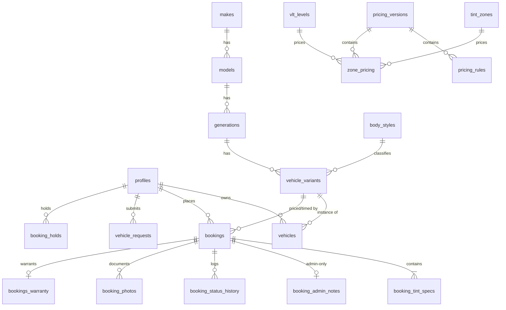

# 02 — Database Schema (Supabase Postgres)

Copy-paste-ready SQL, organized as migration files. Apply in order with the Supabase CLI (`supabase/migrations/`). After every schema change: `supabase gen types typescript` → `src/lib/database.types.ts`.

Conventions: `snake_case`; `uuid` PKs via `gen_random_uuid()`; money `numeric(10,2)` EUR; instants `timestamptz` (UTC); all slot math done server-side in the workshop timezone (`Europe/Paris`, stored in `app_settings`). RLS policies live in `03_AUTH_AND_SECURITY.md` (migration `0004_rls.sql`) — **schema and policies ship in the same PR; a table must never exist without its policies.**

---

## 1. `0001_extensions_enums.sql`

```sql
create extension if not exists btree_gist;   -- exclusion constraints on (int, tstzrange)
create extension if not exists pg_trgm;      -- admin search (clients, plates)

create type user_role       as enum ('client', 'staff', 'admin');
create type service_type    as enum ('tint', 'detailing', 'wrapping', 'mechanical');
create type body_style_code as enum ('citadine_3p','citadine_5p','berline_4p','coupe_2p',
                                     'break_5p','suv_5p','monospace','utilitaire','pickup');
create type tint_zone_code  as enum ('pare_brise','front_sides','rear_sides',
                                     'rear_window','panoramic_roof');
create type zone_group      as enum ('avant','arriere','option');
create type booking_status  as enum ('requested','confirmed','in_progress','completed',
                                     'cancelled','no_show');
create type legal_flag      as enum ('compliant','non_compliant_ack');
create type photo_kind      as enum ('before','after');
create type request_status  as enum ('new','resolved','rejected');
create type pricing_status  as enum ('draft','published','archived');
```

Notes: the enum matches the **shipped UI** (`pare_brise` full-windshield zone; no `windshield_strip` — see `00_IMPLEMENTATION_GUIDE.md` §4). New zones/services are `alter type … add value` — no migration of data.

---

## 2. `0002_tables.sql` — identity, taxonomy, catalog

```sql
-- ============ identity ============
create table public.profiles (
  id           uuid primary key references auth.users(id) on delete cascade,
  role         user_role   not null default 'client',
  full_name    text,
  email        text,
  phone        text,
  is_anonymous boolean     not null default true,   -- mirrors auth state at creation; flipped on email link
  created_at   timestamptz not null default now(),
  updated_at   timestamptz not null default now()
);
-- No unique on email: anonymous profiles have null email; linking enforces uniqueness in auth.users.

-- ============ vehicle taxonomy (admin-managed) ============
create table public.makes (
  id            uuid primary key default gen_random_uuid(),
  name          text not null unique,
  slug          text not null unique,
  logo_url      text,
  display_order int  not null default 0,
  is_active     boolean not null default true
);

create table public.models (
  id        uuid primary key default gen_random_uuid(),
  make_id   uuid not null references public.makes(id) on delete cascade,
  name      text not null,
  slug      text not null,
  is_active boolean not null default true,
  unique (make_id, slug)
);

create table public.generations (
  id         uuid primary key default gen_random_uuid(),
  model_id   uuid not null references public.models(id) on delete cascade,
  name       text not null,                -- "G20"
  year_start int  not null,
  year_end   int,                          -- null = current
  is_active  boolean not null default true,
  check (year_end is null or year_end >= year_start)
);

create table public.body_styles (
  code                 body_style_code primary key,
  label_fr             text not null,      -- "Berline 4 portes"
  door_count           int  not null,
  glass_surface_factor numeric(4,2) not null,  -- citadine_3p 0.70 … suv_5p 1.40
  size_class           text not null check (size_class in ('S','M','L','XL')),
  display_order        int  not null default 0
);

create table public.vehicle_variants (      -- ★ the funnel's resolution leaf
  id                 uuid primary key default gen_random_uuid(),
  generation_id      uuid not null references public.generations(id) on delete cascade,
  body_style_code    body_style_code not null references public.body_styles(code),
  base_labor_minutes int  not null default 0,   -- vehicle-specific overhead ON TOP of zone minutes
  notes              text,                      -- "frameless windows +10min"
  is_active          boolean not null default true,
  unique (generation_id, body_style_code)
);

-- ============ client garage ============
create table public.vehicles (
  id         uuid primary key default gen_random_uuid(),
  user_id    uuid not null references public.profiles(id) on delete cascade,
  variant_id uuid not null references public.vehicle_variants(id),
  year       int,
  color      text,
  plate      text,          -- French format, free text
  nickname   text,
  created_at timestamptz not null default now()
);

-- ============ tint catalog ============
create table public.tint_zones (
  code               tint_zone_code primary key,
  label_fr           text not null,
  detail_fr          text,                       -- "(paire)"
  zone_group         zone_group not null,        -- drives which UI slider applies
  is_front           boolean not null,           -- true ⇒ 70% legal floor applies
  legally_restricted boolean not null,
  base_minutes       int  not null,              -- film labor minutes for this zone
  display_order      int  not null default 0,
  is_active          boolean not null default true
);

create table public.vlt_levels (
  vlt_percent    int primary key,                -- 5,20,35,50,70,85
  label_fr       text not null,                  -- "20% — Privacy"
  is_front_legal boolean generated always as (vlt_percent >= 70) stored,
  is_active      boolean not null default true
);

-- ============ versioned pricing ============
create table public.pricing_versions (
  id           uuid primary key default gen_random_uuid(),
  status       pricing_status not null default 'draft',
  label        text,
  created_by   uuid references public.profiles(id),
  created_at   timestamptz not null default now(),
  published_at timestamptz
);
-- exactly one published version at a time:
create unique index one_published_pricing on public.pricing_versions (status)
  where status = 'published';

create table public.pricing_rules (              -- base per body style
  id                uuid primary key default gen_random_uuid(),
  version_id        uuid not null references public.pricing_versions(id) on delete cascade,
  body_style_code   body_style_code not null references public.body_styles(code),
  base_price        numeric(10,2) not null,
  labor_rate_per_min numeric(6,2) not null,
  unique (version_id, body_style_code)
);

create table public.zone_pricing (               -- delta per zone × VLT
  id          uuid primary key default gen_random_uuid(),
  version_id  uuid not null references public.pricing_versions(id) on delete cascade,
  zone_code   tint_zone_code not null references public.tint_zones(code),
  vlt_percent int not null references public.vlt_levels(vlt_percent),
  price_delta numeric(10,2) not null,
  unique (version_id, zone_code, vlt_percent)
);

-- ============ workshop configuration ============
create table public.workshop_hours (
  weekday    int primary key check (weekday between 1 and 7),  -- 1 = Monday (ISO)
  is_open    boolean not null default true,
  open_time  time,
  close_time time,
  check (not is_open or (open_time is not null and close_time is not null and close_time > open_time))
);

create table public.blackout_dates (
  id         uuid primary key default gen_random_uuid(),
  day        date not null unique,
  reason     text not null,
  created_by uuid references public.profiles(id),
  created_at timestamptz not null default now()
);

create table public.app_settings (   -- single-row-per-key config, admin-editable
  key        text primary key,
  value      jsonb not null,
  updated_at timestamptz not null default now(),
  updated_by uuid references public.profiles(id)
);
```

### Bookings, holds, specs

```sql
-- ============ soft-locks (slot holds) ============
create table public.booking_holds (
  id         uuid primary key default gen_random_uuid(),
  user_id    uuid not null references public.profiles(id) on delete cascade,
  bay_index  int  not null default 1,
  slot_start timestamptz not null,
  slot_end   timestamptz not null,
  expires_at timestamptz not null,
  created_at timestamptz not null default now(),
  check (slot_end > slot_start),
  -- one live hold per user (old ones are deleted by the RPC):
  unique (user_id),
  -- two holds can never overlap on a bay:
  exclude using gist (bay_index with =, tstzrange(slot_start, slot_end) with &&)
);
-- NOTE: expired rows still block the constraint until deleted; hold_slot()/get_available_slots()
-- delete expired holds first. Optionally add pg_cron: delete from booking_holds where expires_at < now().

-- ============ bookings ============
create sequence public.booking_ref_seq start 1000;

create table public.bookings (
  id                  uuid primary key default gen_random_uuid(),
  reference           text not null unique,        -- 'TP-2026-1042', set by create_booking
  user_id             uuid references public.profiles(id) on delete set null,  -- null for admin walk-ins
  vehicle_id          uuid references public.vehicles(id) on delete set null,
  variant_id          uuid not null references public.vehicle_variants(id),
  service_type        service_type not null default 'tint',
  bay_index           int  not null default 1,
  slot_start          timestamptz not null,
  slot_end            timestamptz not null,
  duration_min        int  not null,               -- snapshot
  status              booking_status not null default 'requested',
  legal_flag          legal_flag not null default 'compliant',
  price_total         numeric(10,2) not null,      -- snapshot
  price_breakdown     jsonb not null,              -- {base, zones:[…], labor, limo_supplement}
  currency            text not null default 'EUR',
  pricing_version_id  uuid not null references public.pricing_versions(id),
  contact_name        text not null,
  contact_phone       text not null,
  contact_email       text,
  client_notes        text,
  cancellation_reason text,
  created_by_admin    boolean not null default false,
  created_at          timestamptz not null default now(),
  updated_at          timestamptz not null default now(),
  check (slot_end > slot_start),
  -- ★ the anti-double-booking guarantee (DB-level, final arbiter):
  constraint bookings_no_overlap exclude using gist (
    bay_index with =,
    tstzrange(slot_start, slot_end) with &&
  ) where (status in ('requested','confirmed','in_progress'))
);

create table public.booking_tint_specs (
  id          uuid primary key default gen_random_uuid(),
  booking_id  uuid not null references public.bookings(id) on delete cascade,
  zone_code   tint_zone_code not null references public.tint_zones(code),
  vlt_percent int not null references public.vlt_levels(vlt_percent),
  price_delta numeric(10,2) not null,   -- snapshot
  minutes     int not null,             -- snapshot
  is_legal    boolean not null,         -- snapshot of compliance eval
  unique (booking_id, zone_code)
);

-- admin-only notes live in their own table so RLS can hide them entirely from clients
create table public.booking_admin_notes (
  booking_id uuid primary key references public.bookings(id) on delete cascade,
  notes      text not null default '',
  updated_by uuid references public.profiles(id),
  updated_at timestamptz not null default now()
);

create table public.booking_status_history (
  id         uuid primary key default gen_random_uuid(),
  booking_id uuid not null references public.bookings(id) on delete cascade,
  from_status booking_status,
  to_status   booking_status not null,
  changed_by  uuid references public.profiles(id),
  note        text,
  changed_at  timestamptz not null default now()
);

create table public.booking_photos (
  id           uuid primary key default gen_random_uuid(),
  booking_id   uuid not null references public.bookings(id) on delete cascade,
  kind         photo_kind not null,
  storage_path text not null,           -- 'bookings/<booking_id>/<uuid>.jpg' in bucket booking-photos
  created_by   uuid references public.profiles(id),
  created_at   timestamptz not null default now()
);

create table public.bookings_warranty (
  booking_id     uuid primary key references public.bookings(id) on delete cascade,
  warranty_years int not null check (warranty_years between 1 and 10),
  issued_by      uuid references public.profiles(id),
  issued_at      timestamptz not null default now()
);

-- ============ taxonomy gap leads ============
create table public.vehicle_requests (
  id                  uuid primary key default gen_random_uuid(),
  user_id             uuid references public.profiles(id) on delete set null,
  raw_text            text not null,
  contact_email       text,
  status              request_status not null default 'new',
  resolved_variant_id uuid references public.vehicle_variants(id),
  resolved_by         uuid references public.profiles(id),
  created_at          timestamptz not null default now(),
  resolved_at         timestamptz
);
```

### Indexes

```sql
create index on public.models (make_id) where is_active;
create index on public.generations (model_id) where is_active;
create index on public.vehicle_variants (generation_id) where is_active;
create index on public.vehicles (user_id);
create index on public.bookings (user_id, slot_start desc);
create index on public.bookings (slot_start) where status in ('requested','confirmed','in_progress');
create index on public.booking_tint_specs (booking_id);
create index on public.booking_status_history (booking_id, changed_at);
create index on public.booking_photos (booking_id);
create index on public.zone_pricing (version_id);
create index on public.pricing_rules (version_id);
create index profiles_name_trgm on public.profiles using gin (full_name gin_trgm_ops);
create index vehicles_plate_trgm on public.vehicles using gin (plate gin_trgm_ops);
```

---

## 3. `0003_functions_triggers.sql` — helpers & lifecycle plumbing

Full bodies of the business RPCs (`quote_booking`, `get_available_slots`, `hold_slot`, `create_booking`, `set_booking_status`, `cancel_booking_client`, `admin_create_booking`, `publish_pricing`, `resolve_vehicle_request`) are specified in `04_BUSINESS_LOGIC.md` — that doc is the contract; keep the SQL there and here in sync. This migration also contains the plumbing below.

```sql
-- --- role helper used by every admin policy ---
create or replace function public.is_admin()
returns boolean
language sql stable security definer
set search_path = public
as $$
  select exists (
    select 1 from public.profiles
    where id = auth.uid() and role = 'admin'
  );
$$;
revoke all on function public.is_admin() from public;
grant execute on function public.is_admin() to authenticated;

-- --- auto-create a profile for every new auth user (incl. anonymous) ---
create or replace function public.handle_new_user()
returns trigger
language plpgsql security definer
set search_path = public
as $$
begin
  insert into public.profiles (id, is_anonymous, email)
  values (new.id, coalesce(new.is_anonymous, true), new.email)  -- auth.users.is_anonymous is authoritative
  on conflict (id) do nothing;
  return new;
end;
$$;
create trigger on_auth_user_created
  after insert on auth.users
  for each row execute function public.handle_new_user();

-- --- when an anonymous user links an email, sync the profile ---
create or replace function public.handle_user_email_linked()
returns trigger
language plpgsql security definer
set search_path = public
as $$
begin
  if new.email is not null and new.email is distinct from old.email then
    update public.profiles
      set email = new.email, is_anonymous = false, updated_at = now()
      where id = new.id;
  end if;
  return new;
end;
$$;
create trigger on_auth_user_email_linked
  after update of email on auth.users
  for each row execute function public.handle_user_email_linked();

-- --- updated_at bookkeeping ---
create or replace function public.touch_updated_at()
returns trigger language plpgsql as $$
begin new.updated_at := now(); return new; end; $$;
create trigger bookings_touch  before update on public.bookings  for each row execute function public.touch_updated_at();
create trigger profiles_touch  before update on public.profiles  for each row execute function public.touch_updated_at();

-- --- current published pricing helpers ---
create or replace function public.current_pricing_version_id()
returns uuid language sql stable as $$
  select id from public.pricing_versions where status = 'published' limit 1;
$$;

create or replace view public.v_current_pricing_rules as
  select pr.* from public.pricing_rules pr
  where pr.version_id = public.current_pricing_version_id();

create or replace view public.v_current_zone_pricing as
  select zp.* from public.zone_pricing zp
  where zp.version_id = public.current_pricing_version_id();
-- Views run with invoker rights by default in Postgres 15+ (`security_invoker=on` if needed);
-- underlying tables are readable by everyone (catalog data), see RLS doc.

-- --- booking reference generator ---
create or replace function public.next_booking_reference()
returns text language sql volatile as $$
  select 'TP-' || extract(year from now())::int || '-' || nextval('public.booking_ref_seq')::text;
$$;
```

---

## 4. Status transition rules (enforced in `set_booking_status`, documented here)

```
requested   → confirmed | cancelled
confirmed   → in_progress | cancelled | no_show
in_progress → completed | cancelled
completed   → (terminal)
cancelled   → (terminal)
no_show     → (terminal)
```
Client may only trigger `requested|confirmed → cancelled`, and only while `now() < slot_start - cancellation_cutoff_hours` (from `app_settings`). Admin may perform any legal transition at any time. Every transition writes `booking_status_history`.

---

## 5. `0005_storage.sql` — buckets

```sql
insert into storage.buckets (id, name, public) values
  ('booking-photos', 'booking-photos', false),
  ('brand-assets',   'brand-assets',   true);   -- make logos etc.
```
Object path convention for `booking-photos`: `bookings/<booking_id>/<uuid>.<ext>`. Policies in `03_AUTH_AND_SECURITY.md` §6 key off that first path segment. Clients read their photos through `createSignedUrl` (or direct select allowed by policy); only admins write.

---

## 6. Realtime publication

```sql
alter publication supabase_realtime add table public.bookings;
```
`postgres_changes` respects RLS: admins receive all booking changes (queue/agenda live refresh); a client receives only their own rows (status timeline live refresh). **Do not** rely on realtime for the public availability grid — an anonymous user cannot see other users' bookings, so they'd get no events. The calendar refetches `get_available_slots` on: day selection, window focus, a 30 s interval while mounted, and any hold/booking RPC failure. This is documented behavior, not a bug.

---

## 7. `app_settings` seed keys (single source for tunables)

| key | seed value | used by |
|---|---|---|
| `timezone` | `"Europe/Paris"` | all slot math |
| `slot_granularity_min` | `30` | availability grid, duration snapping |
| `bay_count` | `1` | availability, exclusion scope |
| `cancellation_cutoff_hours` | `24` | client cancel/reschedule |
| `hold_ttl_minutes` | `10` | `hold_slot` |
| `limo_vlt_threshold` | `20` | pricing (film limousine) |
| `limo_supplement` | `30.00` | pricing |
| `min_lead_time_hours` | `2` | earliest same-day slot offered |
| `booking_horizon_days` | `90` | how far ahead clients can book (UI caps at ~3 months) |
| `contact_phone` | `"06 05 50 50 28"` | site header / emails |
| `workshop_address` | `"19 Rue de l'industrie, 67400 Illkirch-Graffenstaden"` | confirm page / emails |

---

## 8. `0006_seed.sql` — seed data (must reproduce the shipped UI exactly)

```sql
-- body styles (label, doors, glass factor, class) — from PRICING_RULES mock
insert into public.body_styles (code, label_fr, door_count, glass_surface_factor, size_class, display_order) values
  ('citadine_3p','Citadine 3 portes',3,0.70,'S',1),
  ('citadine_5p','Citadine 5 portes',5,0.80,'S',2),
  ('coupe_2p','Coupé 2 portes',2,0.85,'M',3),
  ('berline_4p','Berline 4 portes',4,1.00,'M',4),
  ('break_5p','Break 5 portes',5,1.15,'L',5),
  ('monospace','Monospace',5,1.25,'L',6),
  ('suv_5p','SUV 5 portes',5,1.40,'XL',7),
  ('utilitaire','Utilitaire',4,1.30,'XL',8),
  ('pickup','Pick-up',4,1.35,'XL',9);

-- tint zones — codes, labels, groups, minutes exactly as TINT_ZONES mock
insert into public.tint_zones (code, label_fr, detail_fr, zone_group, is_front, legally_restricted, base_minutes, display_order) values
  ('pare_brise','Pare-brise',null,'avant',true,true,40,1),
  ('front_sides','Vitres avant latérales','(paire)','avant',true,true,30,2),
  ('rear_sides','Vitres arrière latérales','(paire)','arriere',false,false,35,3),
  ('rear_window','Lunette arrière',null,'arriere',false,false,30,4),
  ('panoramic_roof','Toit panoramique',null,'option',false,false,25,5);

insert into public.vlt_levels (vlt_percent, label_fr) values
  (5,'5% — Limo'),(20,'20% — Privacy'),(35,'35% — Confort'),
  (50,'50% — Subtil'),(70,'70% — Légal avant'),(85,'85% — Quasi clair');

-- workshop hours — from WORKSHOP_WEEK mock
insert into public.workshop_hours (weekday, is_open, open_time, close_time) values
  (1,true,'09:00','18:00'),(2,true,'09:00','18:00'),(3,true,'09:00','18:00'),
  (4,true,'09:00','18:00'),(5,true,'09:00','19:00'),(6,true,'09:00','16:00'),
  (7,false,null,null);

-- settings (see §7 table)
insert into public.app_settings (key, value) values
  ('timezone','"Europe/Paris"'),('slot_granularity_min','30'),('bay_count','1'),
  ('cancellation_cutoff_hours','24'),('hold_ttl_minutes','10'),
  ('limo_vlt_threshold','20'),('limo_supplement','30.00'),
  ('min_lead_time_hours','2'),('booking_horizon_days','90'),
  ('contact_phone','"06 05 50 50 28"'),
  ('workshop_address','"19 Rue de l''industrie, 67400 Illkirch-Graffenstaden"');

-- pricing v1 — published immediately
with v as (
  insert into public.pricing_versions (status, label, published_at)
  values ('published','Grille initiale (UI phase)', now()) returning id
)
insert into public.pricing_rules (version_id, body_style_code, base_price, labor_rate_per_min)
select v.id, x.code, x.base, 0.40 from v, (values
  ('citadine_3p'::body_style_code,180.00),('citadine_5p',200.00),('coupe_2p',220.00),
  ('berline_4p',240.00),('break_5p',280.00),('monospace',300.00),
  ('suv_5p',340.00),('utilitaire',320.00),('pickup',330.00)
) as x(code, base);

-- zone × VLT grid: seed FLAT per zone (delta independent of VLT), matching the shipped
-- quote card (pare_brise 90 / front_sides 60 / rear_sides 70 / rear_window 50 / roof 40).
-- The ×1.2 numbers shown in the mock PricingPage were display-only; the "film limousine"
-- premium is modeled as the booking-level limo_supplement setting instead. Admin can later
-- differentiate any cell — the engine always reads the grid.
insert into public.zone_pricing (version_id, zone_code, vlt_percent, price_delta)
select public.current_pricing_version_id(), z.code, v.vlt_percent,
       case z.code
         when 'pare_brise' then 90.00 when 'front_sides' then 60.00
         when 'rear_sides' then 70.00 when 'rear_window' then 50.00
         when 'panoramic_roof' then 40.00 end
from public.tint_zones z cross join public.vlt_levels v;

-- starter taxonomy (the makes/variants the mock admin screens showed) — extend freely
-- BMW Série 3 G20 2019–, BMW M3 F30 2014–2018, BMW X5 G05 2018–, Tesla Model Y Juniper 2025–,
-- Mini Cooper S F56 2014–2024, Audi RS3 8Y 2021–, Audi Q5 FY 2017–2024 … (write as normal inserts;
-- base_labor_minutes here is vehicle OVERHEAD, e.g. 0–30, since zone minutes are charged separately)
```

Pricing worked example with these seeds (berline_4p, rear_sides 20% + rear_window 20%):
`base 240 + deltas (70+50) + labor (duration × 0.40) + limo 30`. Duration = variant overhead + 35 + 30 min, snapped to 30-min granularity. The exact formula and snapping rules: `04_BUSINESS_LOGIC.md` §2–3. Note the shipped mock quote card omitted base+labor; Phase 2 uses the full formula everywhere (client preview and server snapshot are the same math with the same inputs — decision in `00` §4).

---

## 9. ER overview


