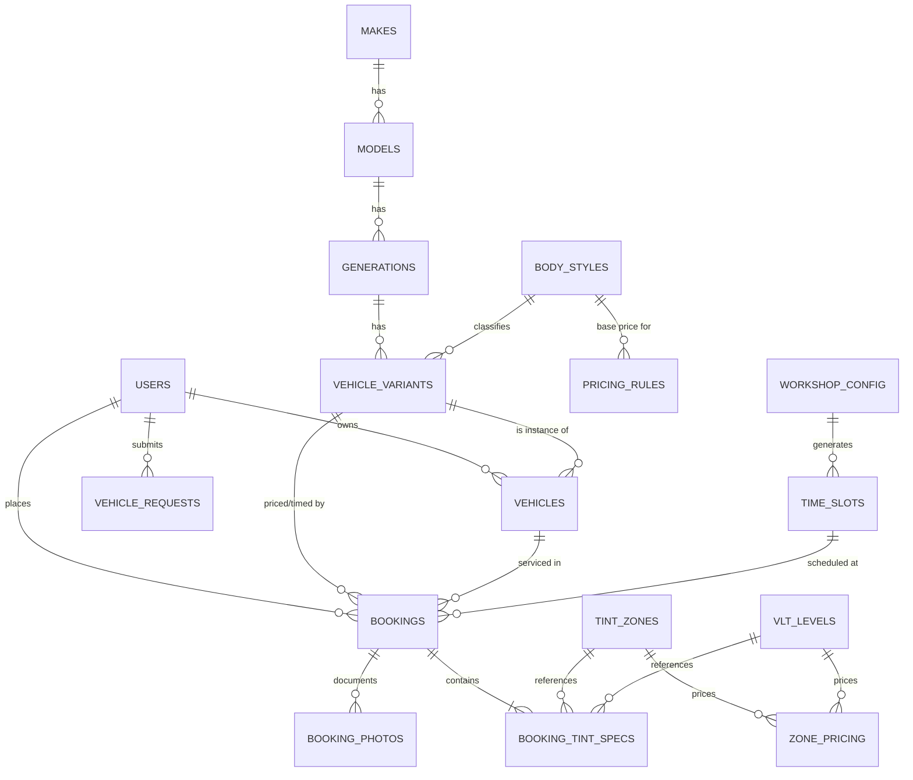

# Tay Performance — Business Requirements Document (V1)

**Product:** Tay Performance Web Application
**Scope:** Version 1 — Professional Automotive Window Tinting (Vitres Teintées)
**Status:** Draft for engineering / design handoff
**Stack target:** Flutter Web (client + admin SPA) · Supabase (Postgres + Auth + Storage + Realtime + Edge Functions)
**Last updated:** 2026-06-22

---

## 1. Executive Summary & Brand Positioning

### 1.1 The business
Tay Performance (`@tay_performance`) is a high-end automotive customization workshop. Unlike retail/DIY tint-film e-commerce players (e.g. Variance Auto, which sells precut kits for self-installation), Tay Performance sells a **bespoke, professional installation service**. The customer never touches film. They book a slot, drop the car, and collect a precision-installed result.

### 1.2 Positioning matrix

| Axis | Variance Auto (reference) | Tay Performance (target) |
|---|---|---|
| Core product | Physical DIY kits (SKU/cart) | Time + craftsmanship (booking/service) |
| Conversion goal | Add-to-cart / checkout | Reserve a workshop slot (RDV) |
| Pricing driver | Film m² + kit complexity | Vehicle class × glass surface × tint spec × labor time |
| Brand feel | Utilitarian, catalog-dense | Executive, dark, precision, "digital garage" |
| Trust signal | Product reviews | Before/after gallery, installer credentials, warranty |
| Fulfillment | Shipping | Scheduled in-person appointment |

### 1.3 Why we reuse Variance Auto's *logic* but not its *UX*
Variance Auto solved the hardest data problem in this domain: a clean **vehicle taxonomy filter** (Make → Model → Generation/Body → Variant) that resolves any car to a precut SKU. We port that exact resolution funnel — but the leaf node is no longer "a film kit to ship", it is **a priced, time-estimated bookable service** for that specific car. The vehicle taxonomy becomes the spine of pricing *and* scheduling duration.

### 1.4 V1 success criteria
- A new visitor can resolve their exact vehicle, see a transparent price + legal-compliance hint, and confirm a real appointment in **under 3 minutes**.
- Admin can see the day's car queue, durations, and tint specs on one screen.
- Zero double-bookings (slot integrity enforced at the database level, not the UI).
- Architecture is **service-type agnostic** so detailing / wrapping / mechanical mods drop in without schema migration of the core booking engine.

### 1.5 Out of scope for V1 (designed-for, not built)
Online payment capture (V1 takes deposits-optional, settle in-workshop), multi-bay parallel scheduling optimization, loyalty program, SMS gateway (email only in V1), the non-tint service catalogs (detailing/wrapping/mechanical) — these exist as `service_type` enum values and empty option tables only.

---

## 2. V1 Feature Scope

### 2.1 Dynamic Vehicle Multi-Step Filter
A progressive disclosure funnel that resolves a car to a **vehicle_variant** (the pricing/duration key).

Funnel steps:
1. **Make** — e.g. Audi, BMW, Renault, Tesla.
2. **Model** — filtered by make (e.g. BMW → Série 3, X5, M4).
3. **Year / Generation** — model years map to a `generation` (e.g. BMW Série 3 → G20 2019–present). Year picker resolves to generation internally.
4. **Body Style / Doors** — the variant that actually changes glass surface: `berline_4p`, `coupe_2p`, `break_5p`, `suv_5p`, `citadine_3p`, `monospace`, `utilitaire`. This is the decisive node — a 3-door citadine and a 5-door SUV with the same badge have very different glass area, price, and labor time.

Behavior:
- Each step is **dependent**: selecting a parent resets children.
- Steps render only valid children (no dead-ends). If a model has a single generation, auto-skip step 3.
- Funnel state is URL-serializable (`?make=bmw&model=serie-3&gen=g20&body=berline_4p`) for shareable quotes and back-button integrity.
- "I don't see my car" fallback → free-text request that creates a `vehicle_request` lead for admin to add to taxonomy.
- Resolution emits a single `vehicle_variant_id` consumed by both the Tint Engine and the Booking engine.

### 2.2 Tint Selection Engine
The customer configures the actual job after the car is resolved.

- **Zone splitting:** independent selection for `front_sides` (vitres avant latérales), `rear_sides` (vitres arrière latérales), `rear_window` (lunette arrière), and optional `windshield_strip` (bande pare-soleil) and `panoramic_roof`.
- **VLT % per zone:** selectable visible-light-transmission levels (e.g. 5%, 20%, 35%, 50%, 70%, 85%).
- **Legal compliance engine (France):** front zones (windshield + front side windows) must transmit **≥ 70% VLT**. The engine:
  - Hard-blocks (or strongly warns + requires explicit acknowledgement) any `front_sides` selection below 70%.
  - Allows rear zones (`rear_sides`, `rear_window`, roof) at any opacity — legally unrestricted.
  - Allows only a **≤10 cm sun strip** on the windshield; full windshield film is disallowed.
  - Surfaces the consequence inline: class-4 offense, €135 fixed fine (€90 minoré / €375 majoré), −3 license points.
- **Recommended presets:** "Legal Daily" (front 70 / rear 20), "Privacy Max" (front 70 / rear 5), "Subtle" (front — / rear 35).
- Output: a `BookingTintSpec[]` array (one row per zone) attached to the booking, plus a computed price delta.

### 2.3 Interactive RDV & Booking Calendar
- **Availability is server-truth:** slots are generated from workshop operating hours minus existing bookings minus blackout dates, computed in an Edge Function / Postgres view, never inferred client-side.
- **Dynamic duration:** appointment length is derived from `vehicle_variant.base_labor_minutes` + per-zone film time, snapped to the workshop slot granularity (e.g. 30-min blocks). A citadine 3p full tint ≈ 90 min; an SUV 5p full tint ≈ 180 min. The calendar only offers start times where the *full required duration* fits before closing and before the next booking.
- **Flow:** pick date → grid of valid start times (greyed = unavailable/insufficient duration) → hold slot (soft lock with TTL) → confirm → booking row `status = confirmed`.
- **Soft-lock / race protection:** selecting a slot writes a short-TTL hold; confirmation converts it. Expired holds auto-release. A Postgres exclusion constraint guarantees no two `confirmed` bookings overlap on the same bay.
- **Realtime:** Supabase Realtime pushes slot invalidation so two users configuring the same slot see live updates.
- Reschedule / cancel honor a configurable cutoff window (e.g. ≥24h before start).

### 2.4 Client Portal & Dashboard
- Auth via Supabase (email magic-link / OAuth).
- **My Garage:** saved vehicles (resolved variants) for 1-tap rebooking.
- **My Bookings:** upcoming + history with status timeline (requested → confirmed → in_progress → completed / cancelled / no_show), tint spec recap, price, and post-job before/after photos + warranty record.
- Notes field visible to client; internal admin notes hidden.

### 2.5 Admin Workshop Panel
- **Daily Queue:** chronological list/board of the day's cars — variant, owner, zones, VLT per zone, computed duration, status. One-glance "what's rolling in today".
- **Calendar management:** define operating hours, slot granularity, blackout dates, per-day capacity / number of bays.
- **Booking lifecycle:** advance status, add internal notes, attach completion photos, issue warranty.
- **Taxonomy admin:** CRUD on makes/models/generations/variants; resolve `vehicle_request` leads into real taxonomy rows.
- **Pricing admin:** edit the pricing matrix (base price per body class, per-zone film price, VLT surcharges, labor rate) without code deploys.
- **Client/vehicle admin:** edit a customer's vehicles and contact info.

---

## 3. Data Models & Entity-Relationship Schema

### 3.1 ER overview (Mermaid)



### 3.2 Enums

```
user_role        : admin | staff | client
service_type     : tint | detailing | wrapping | mechanical      -- only `tint` active in V1
body_style_code  : citadine_3p | citadine_5p | berline_4p | coupe_2p
                 | break_5p | suv_5p | monospace | utilitaire | pickup
tint_zone_code   : front_sides | rear_sides | rear_window
                 | windshield_strip | panoramic_roof
booking_status   : requested | confirmed | in_progress | completed
                 | cancelled | no_show
slot_status      : open | held | booked | blocked
legal_flag       : compliant | non_compliant_ack   -- ack = client explicitly accepted illegal front spec
```

### 3.3 Table definitions

#### `users`
| Field | Type | Notes |
|---|---|---|
| id | uuid PK | = Supabase `auth.uid()` |
| role | user_role | default `client` |
| full_name | text | |
| email | text unique | |
| phone | text | nullable |
| created_at | timestamptz | default now() |

> RLS: a client sees only `id = auth.uid()`; admin/staff see all.

#### `makes`
| Field | Type | Notes |
|---|---|---|
| id | uuid PK | |
| name | text unique | "BMW" |
| slug | text unique | "bmw" |
| logo_url | text | storage path |
| display_order | int | merch ordering |
| is_active | bool | soft hide |

#### `models`
| Field | Type | Notes |
|---|---|---|
| id | uuid PK | |
| make_id | uuid FK → makes | |
| name | text | "Série 3" |
| slug | text | "serie-3" |
| is_active | bool | |
| | | unique(make_id, slug) |

#### `generations`
| Field | Type | Notes |
|---|---|---|
| id | uuid PK | |
| model_id | uuid FK → models | |
| name | text | "G20" |
| year_start | int | 2019 |
| year_end | int | null = current |
| is_active | bool | |

> Year picker in the UI resolves `year` → the generation where `year_start ≤ year ≤ coalesce(year_end, 9999)`.

#### `body_styles`
| Field | Type | Notes |
|---|---|---|
| id | uuid PK | |
| code | body_style_code | |
| label_fr | text | "Berline 4 portes" |
| door_count | int | |
| glass_surface_factor | numeric | relative glass area multiplier (citadine_3p≈0.7 … suv_5p≈1.4) |
| size_class | text | S / M / L / XL — drives base price + labor |

#### `vehicle_variants`  ← **the resolution leaf**
| Field | Type | Notes |
|---|---|---|
| id | uuid PK | |
| generation_id | uuid FK → generations | |
| body_style_id | uuid FK → body_styles | |
| base_labor_minutes | int | base install time for this body on this gen |
| notes | text | e.g. "frameless windows +10min" |
| is_active | bool | |
| | | unique(generation_id, body_style_id) |

> A funnel resolves to exactly one `vehicle_variant_id`. This id is the single key consumed by pricing and scheduling.

#### `vehicles`  (a client's actual car — "My Garage")
| Field | Type | Notes |
|---|---|---|
| id | uuid PK | |
| user_id | uuid FK → users | |
| variant_id | uuid FK → vehicle_variants | |
| year | int | concrete model year |
| color | text | nullable |
| plate | text | nullable, France format |
| nickname | text | "Daily M3" |
| created_at | timestamptz | |

#### `tint_zones`
| Field | Type | Notes |
|---|---|---|
| id | uuid PK | |
| code | tint_zone_code | |
| label_fr | text | "Vitres avant latérales" |
| is_front | bool | true ⇒ subject to 70% legal floor |
| legally_restricted | bool | front_sides & windshield_strip = true |

#### `vlt_levels`
| Field | Type | Notes |
|---|---|---|
| id | uuid PK | |
| vlt_percent | int | 5,20,35,50,70,85 |
| label_fr | text | "20% — Privacy" |
| is_front_legal | bool | true only for ≥70 |

#### `pricing_rules`  (base price per body size class)
| Field | Type | Notes |
|---|---|---|
| id | uuid PK | |
| body_style_id | uuid FK → body_styles | |
| base_price | numeric | full-car baseline for that size |
| labor_rate_per_min | numeric | for duration-based surcharge |
| currency | text | "EUR" |
| valid_from | timestamptz | versioned pricing |

#### `zone_pricing`  (per zone × VLT add/override)
| Field | Type | Notes |
|---|---|---|
| id | uuid PK | |
| zone_id | uuid FK → tint_zones | |
| vlt_id | uuid FK → vlt_levels | |
| price_delta | numeric | added per selected zone |
| | | unique(zone_id, vlt_id) |

#### `workshop_config`
| Field | Type | Notes |
|---|---|---|
| id | uuid PK | |
| open_time | time | e.g. 09:00 |
| close_time | time | e.g. 18:00 |
| slot_granularity_min | int | 30 |
| bay_count | int | parallel cars (V1 = 1) |
| weekday | int | 1–7; one row per working day |

#### `blackout_dates`
| Field | Type | Notes |
|---|---|---|
| id | uuid PK | date | reason | created_by |

#### `time_slots`  (generated/materialized availability)
| Field | Type | Notes |
|---|---|---|
| id | uuid PK | |
| slot_start | timestamptz | |
| slot_end | timestamptz | |
| bay_index | int | |
| status | slot_status | open/held/booked/blocked |
| hold_expires_at | timestamptz | null unless held |
| held_by | uuid | nullable user |

> May be a materialized table or a computed view + exclusion constraint. Integrity rule lives in the DB, not the client.

#### `bookings`
| Field | Type | Notes |
|---|---|---|
| id | uuid PK | |
| user_id | uuid FK → users | |
| vehicle_id | uuid FK → vehicles | |
| variant_id | uuid FK → vehicle_variants | denormalized for pricing snapshot |
| service_type | service_type | `tint` in V1 |
| slot_start | timestamptz | |
| slot_end | timestamptz | derived from duration |
| computed_duration_min | int | snapshot at booking time |
| status | booking_status | |
| legal_flag | legal_flag | compliant / non_compliant_ack |
| price_total | numeric | snapshot |
| currency | text | |
| client_notes | text | visible to client |
| admin_notes | text | RLS-hidden from client |
| created_at | timestamptz | |
| | | EXCLUDE overlap on (bay, tstzrange(slot_start,slot_end)) WHERE status in (confirmed,in_progress) |

#### `booking_tint_specs`  (one row per configured zone)
| Field | Type | Notes |
|---|---|---|
| id | uuid PK | |
| booking_id | uuid FK → bookings | |
| zone_id | uuid FK → tint_zones | |
| vlt_id | uuid FK → vlt_levels | |
| price_delta | numeric | snapshot |
| is_legal | bool | snapshot of compliance eval |

#### `booking_photos`
| Field | Type | Notes |
|---|---|---|
| id | uuid PK | booking_id FK | url | kind (before/after) | created_at |

#### `vehicle_requests`  (taxonomy gap leads)
| Field | Type | Notes |
|---|---|---|
| id | uuid PK | user_id | raw_text | status (new/resolved) | created_at |

### 3.4 Pricing Matrix logic

Final price is computed deterministically and **snapshotted** onto the booking:

```
price_total =
    pricing_rules.base_price[body_style]                       -- size baseline
  + SUM(zone_pricing.price_delta[zone, vlt])  for each selected zone
  + (vehicle_variant.base_labor_minutes * pricing_rules.labor_rate_per_min)
```

Worked illustration (numbers illustrative, admin-editable):

| Car | Body | Base | Zones selected | Zone deltas | Labor | Total |
|---|---|---|---|---|---|---|
| Citadine 3p (e.g. Mini One) | citadine_3p (S) | €180 | rear_sides 20, rear_window 20 | €70 | 90min × €0.4 = €36 | **€286** |
| Berline 4p (e.g. Série 3) | berline_4p (M) | €240 | front 70, rear_sides 20, rear_window 20 | €120 | 120min × €0.4 = €48 | **€408** |
| SUV 5p (e.g. X5) | suv_5p (XL) | €340 | full incl. roof | €210 | 180min × €0.4 = €72 | **€622** |

`computed_duration_min` flows from the same `base_labor_minutes` + per-zone film time and is what the calendar uses to fit/grey slots. **One number drives both price and schedule** — that is the core architectural elegance ported from Variance Auto's variant resolution.

### 3.5 Compliance evaluation (server-enforced)
At booking creation, an Edge Function / Postgres trigger re-evaluates each `booking_tint_spec`:
- For any zone where `tint_zones.is_front = true` and `vlt_levels.vlt_percent < 70` → `is_legal = false`.
- If any spec is illegal and the client has not set `legal_flag = non_compliant_ack`, reject the booking.
- Windshield: only `windshield_strip` permitted; full-windshield film rejected outright. Rear zones always `is_legal = true`.

This guarantees the legal rule is enforced regardless of client tampering.

---

## 4. Scalability Hooks (designed-in, not built)
- `service_type` enum + a generic `service_options` pattern means detailing/wrapping/mechanical reuse the same `bookings`, `time_slots`, vehicle taxonomy, and pricing-snapshot machinery. Only new option/pricing tables are added.
- `bay_count` and the bay-indexed exclusion constraint already model multi-bay parallelism for future throughput.
- Pricing is versioned (`valid_from`) and snapshotted, so historical bookings stay accurate after rate changes.

---

## 5. Sources
Legal compliance figures (70% VLT front rule, €135 class-4 fine, −3 points, 10 cm windshield strip, unrestricted rear) verified against current 2026 French regulation summaries:

- [Loi vitre teintée 2026 — Wash & Glass](https://washandglass.fr/loi-vitre-teintee-reglementation-2026/)
- [Vitres teintées : réglementation par voiture — Autolisa](https://www.autolisa.fr/reglementation-des-vitres-teintees-que-dit-la-loi-pour-votre-voiture-en-2026/)
- [Vitres teintées : amende et sanctions — Actiroute](https://www.actiroute.com/reglementation/bareme-infractions/regles-de-circulation/loi-sur-les-vitres-teintees/)
