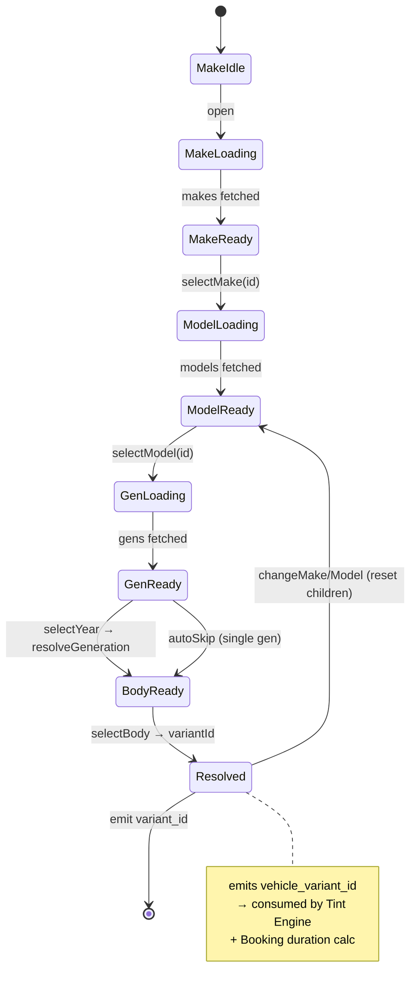

# Tay Performance — Design System & UI Architecture (V1)

**Purpose:** Spec to drive frontend mockup generation (Claude Design / Artifacts) and Flutter Web implementation.
**Aesthetic:** Luxury Dark Mode · High-Performance Digital Garage · executive, precise, ultra-clean motion.
**Last updated:** 2026-06-22

---

## 1. Design Token System

### 1.1 Semantic theme
Dark-first, single theme in V1. Deep obsidian canvas, layered graphite surfaces, a single high-octane accent used sparingly as "instrument light". Think McLaren cockpit / Porsche PCM at night — not neon gamer. Restraint is the luxury signal.

### 1.2 Color palette — Backgrounds & Surfaces (elevation model)

| Token | HEX | Tailwind-ish | Use |
|---|---|---|---|
| `bg/canvas` | `#0A0C0F` | slate-975 | App background, deepest layer |
| `bg/base` | `#0F1318` | slate-950 | Page sections |
| `surface/1` | `#161B22` | slate-900 | Cards, panels (resting) |
| `surface/2` | `#1C232C` | slate-850 | Raised cards, modals, popovers |
| `surface/3` | `#232C37` | slate-800 | Hover elevation, active rows |
| `surface/inset` | `#0C0F13` | — | Wells, input fields, calendar grid bg |
| `border/subtle` | `#252D38` | slate-800/60 | Hairline dividers |
| `border/strong` | `#36414F` | slate-700 | Focused inputs, selected cards |

### 1.3 Color palette — Primary accent (high-octane metallic)

Primary: **"Octane"** — a precise electric amber/copper that reads as warm performance metal, not cheap neon.

| Token | HEX | Use |
|---|---|---|
| `accent/octane-50` | `#FFF4E6` | text on accent fills |
| `accent/octane-300` | `#FFC56B` | hover glow, highlights |
| `accent/octane-500` | `#FF9E1B` | **primary** — CTAs, active step, slider fill |
| `accent/octane-600` | `#E8860A` | pressed |
| `accent/octane-glow` | `rgba(255,158,27,0.18)` | focus ring / ambient glow |

> Alternate cool option (toggle in tokens, do not mix): **"Cryo"** electric ice-blue `#3DE0FF` / `#0FB6E6`. Ship Octane for V1; keep Cryo as a swappable accent scale.

### 1.4 Color palette — Status

| Token | HEX | Meaning |
|---|---|---|
| `status/success` | `#34D399` | Confirmed, completed, slot available |
| `status/pending` | `#FBBF24` | Requested, hold/soft-lock, in-progress |
| `status/warning` | `#F87171` | Legal non-compliance, conflict |
| `status/danger` | `#EF4444` | Cancelled, no-show, hard block |
| `status/info` | `#60A5FA` | Neutral hints, tooltips |
| `status/muted` | `#64748B` | Unavailable/disabled slots |

Each status has a `-bg` companion at ~12% alpha for chip/badge fills (e.g. `status/success-bg = rgba(52,211,153,0.12)`).

### 1.5 Typography

| Role | Family | Weight | Size / Line | Letter-spacing |
|---|---|---|---|---|
| Display (hero) | **Clash Display** / Satoshi | 600 | 56 / 60 | -0.02em |
| H1 | Satoshi | 600 | 36 / 42 | -0.01em |
| H2 | Satoshi | 600 | 28 / 34 | -0.01em |
| H3 | Satoshi | 500 | 22 / 28 | 0 |
| Body-lg | Inter | 400 | 18 / 28 | 0 |
| Body | Inter | 400 | 15 / 24 | 0 |
| Body-sm | Inter | 400 | 13 / 20 | 0 |
| Micro / label | Inter | 500 | 11 / 16 | 0.06em UPPERCASE |
| Numeric / data | **JetBrains Mono** | 500 | tabular | 0 |

> Use the mono tabular face for prices, VLT %, durations, and time-slot labels — it reinforces the "instrument readout" feel and keeps numeric columns aligned.

### 1.6 Spacing, radius, elevation

- **Spacing scale (4pt):** 4 · 8 · 12 · 16 · 24 · 32 · 48 · 64.
- **Radius:** `sm 8` · `md 12` · `lg 16` · `xl 24` · `pill 999`. Cards = `lg`; inputs = `md`; chips = `pill`.
- **Shadows (dark-tuned):** elevation comes from lighter surface + subtle glow, not heavy drop shadows. `shadow/glow = 0 0 0 1px border/subtle, 0 8px 24px rgba(0,0,0,0.45)`. Accent focus = `0 0 0 3px accent/octane-glow`.
- **Grid:** 12-col, max content width 1280, gutter 24.

---

## 2. Layout & Global Navigation

### 2.1 Client-facing shell
```
┌───────────────────────────────────────────────┐
│  TopBar: [TAY • PERFORMANCE]   Services  Galerie │
│          Mon Garage    [ Réserver ]  ◐ avatar   │  ← sticky, bg/base + blur on scroll
├───────────────────────────────────────────────┤
│                                                 │
│   Route content (max-w 1280, centered)          │
│                                                 │
├───────────────────────────────────────────────┤
│  Footer: legal (loi 70% VLT), contact, social   │
└───────────────────────────────────────────────┘
```
Primary CTA `Réserver` is always present in the top bar (Octane fill). Mobile: top bar collapses to logo + hamburger; CTA becomes a sticky bottom bar.

### 2.2 Booking flow layout (the funnel)
Two-column on desktop: **left = configurator steps**, **right = sticky Quote Summary** (live vehicle, selected zones, running price in mono, computed duration, legal badge). Mobile collapses the summary into a sticky bottom sheet that expands on tap. A slim top **stepper** (Véhicule → Teinte → Créneau → Confirmation) shows progress.

### 2.3 Admin shell
```
┌──────────┬────────────────────────────────────┐
│ Sidebar  │  Topbar: date picker · bay selector │
│ ─ File   │ ───────────────────────────────────│
│ ▸ Queue  │                                     │
│ ▸ Agenda │   Workspace (board / calendar / CRUD)│
│ ▸ Clients│                                     │
│ ▸ Véhic. │                                     │
│ ▸ Tarifs │                                     │
│ ▸ Config │                                     │
└──────────┴────────────────────────────────────┘
```
Persistent left rail (collapsible to icons). Admin is data-dense but uses the same tokens — graphite surfaces, mono numerics, Octane only for primary actions and "today" markers.

---

## 3. Component Specifications

### 3.1 Multi-Step Vehicle Selector — state map



Rules:
- Each select is a large card-grid or searchable combobox; **parent change resets all descendants**.
- Disabled/empty children never render (no dead ends).
- Loading state = skeleton chips (see §4).
- "Je ne trouve pas mon véhicule" → opens a `vehicle_request` capture; funnel pauses gracefully.
- Resolved state animates the summary panel updating its car silhouette + size class.

### 3.2 Interactive Booking Grid & Calendar — logic

Visual: month/week mini-calendar on top, **time-slot grid** below. Slots rendered from server availability; each carries enough metadata to know if the *full required duration* fits.

States per slot:
| State | Visual | Interaction |
|---|---|---|
| `available` | surface/2, mono time, subtle Octane left-tick | clickable |
| `insufficient` (duration won't fit) | dimmed, hatched | non-clickable, tooltip "Durée requise: 180 min" |
| `held` (soft-lock by you) | Octane outline + countdown | proceed to confirm |
| `held_other` / `booked` | muted, lock icon | disabled |
| `blocked` (blackout/closed) | striped neutral | disabled |
| `selected` | Octane fill, glow ring | confirm CTA enabled |

Logic:
- Required duration = `vehicle_variant.base_labor_minutes + Σ zone film time`, snapped up to `slot_granularity`.
- A start slot is `available` only if every consecutive block through `start + duration` is free and within `close_time`.
- On select → write soft-lock (TTL countdown shown). Realtime invalidation re-greys slots taken by others mid-session.
- Confirm converts hold → `confirmed`; DB exclusion constraint is the final arbiter (UI optimistic, server authoritative).

### 3.3 Tint Slider / VLT Visualizer

A car schematic (side + rear silhouette) with selectable **zones**; each zone owns a VLT control.

- **Zone chips:** Front sides · Rear sides · Rear window · Windshield strip · Pano roof. Selecting highlights the corresponding glass on the silhouette.
- **VLT slider:** discrete stops (5 · 20 · 35 · 50 · 70 · 85). The slider track renders an actual **darkness gradient** so the user *sees* opacity; the glass on the silhouette tints live to match.
- **Legal layer:**
  - Front zones: stops below 70% render in `status/warning`; dragging below 70 triggers an inline lock + "Illégal en France — min 70% VLT à l'avant (amende 135€, −3 points)". Requires explicit toggle `J'accepte (usage circuit/privé)` to set `legal_flag = non_compliant_ack`, else blocked.
  - Windshield: only the 10 cm strip selectable; full windshield disabled.
  - Rear zones: full range, green/no warning.
- **Live readout (mono):** per-zone `VLT% · +€delta`, plus total. Updates the right-hand Quote Summary.
- Preset buttons: `Legal Daily` · `Privacy Max` · `Subtle` snap all zones at once with a smooth transition.

### 3.4 Quote Summary (sticky)
Card showing: resolved vehicle (make/model/gen/body + size badge), zone list with VLT chips, **price total** (mono, animates on change with a count-up), **estimated duration**, and a **legal status badge** (compliant green / ack-amber). Houses the step's primary CTA.

### 3.5 Admin Daily Queue card
Per-car row/card: time block, owner, vehicle variant, zone+VLT chips, computed duration bar, status pill, quick actions (advance status, open, add photo). Sort by slot_start. "Now" line marker in Octane.

---

## 4. UX Micro-interactions

- **Motion language:** confident, weighted, fast-out/slow-in. Standard `cubic-bezier(0.16, 1, 0.3, 1)` (expo-out), durations 180–280ms. Nothing bouncy/playful — it should feel like precision machinery settling.
- **Step transitions:** funnel steps slide-fade horizontally (24px travel, 220ms); the stepper tick fills Octane left-to-right.
- **Skeleton loaders:** shimmer on `surface/inset` (gradient sweep, 1.2s loop) for make/model grids, slot grid, and queue — never spinners for content; spinners only for terminal confirm actions.
- **Hover (desktop):** cards lift one elevation (`surface/1→/3`), border → `border/strong`, 120ms; CTAs gain `accent/octane-glow` ring.
- **Active/press:** 2px scale-down (0.98) + `accent/octane-600`, 90ms — tactile "click".
- **Slot select:** Octane fill wipes in from the left tick; soft-lock starts a subtle pulsing glow + mono countdown.
- **Price / VLT change:** number count-up/down over 300ms; glass silhouette tint cross-fades (200ms) so opacity change is felt, not jumped.
- **Legal violation:** zone glass flashes `status/warning` once (160ms), slider snaps back to 70 with a short spring unless ack toggled. Honest, not punitive.
- **Success (booking confirmed):** brief Octane sweep across the summary card + checkmark draw-on (stroke 400ms); no confetti — keep it executive.
- **Empty states:** "My Garage" empty shows a ghosted car outline + single CTA. Quiet, premium, never cute.
- **Accessibility:** all status never encoded by color alone (pair icon + label); focus-visible ring = `0 0 0 3px accent/octane-glow`; min 44px touch targets; respects `prefers-reduced-motion` (cross-fades replace travel).

---

## 5. Implementation notes (Flutter Web)
- Token layer as a `ThemeExtension` (`AppColors`, `AppTypography`, `AppRadii`) so Artifacts/HTML mockups and Flutter share one source of truth — mirror these tables into `tokens.dart` and `tailwind.config` for the mockup.
- Funnel state via a single `BookingDraft` notifier (Riverpod) holding `variantId`, `tintSpecs[]`, `slotHold`, `priceTotal`, `legalFlag` — exactly the booking snapshot fields from the BRD.
- Calendar availability + soft-lock TTL come from Supabase (Realtime channel on `time_slots`); never compute availability client-side.
